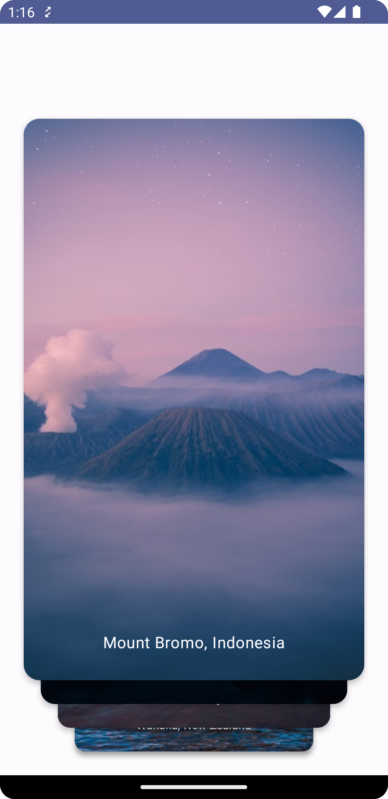

# LazySwipeCards
[](http://developer.android.com/index.html)
[](https://android-arsenal.com/api?level=21)
[](https://search.maven.org/artifact/io.github.aghajari/LazySwipeCards/1.0.1/aar)
[](https://gitter.im/Aghajari/community?utm_source=badge&utm_medium=badge&utm_campaign=pr-badge&utm_content=badge)

**LazySwipeCards** is a card swiping [Jetpack Compose](https://developer.android.com/jetpack/compose) library.

<br>


## Installation

**LazySwipeCards** is available in the `mavenCentral()`, so you just need to add it as a dependency (Module gradle)

Gradle
```gradle
implementation 'io.github.aghajari:LazySwipeCards:1.0.1'

// needs compose-boom 2024.02.01
implementation platform('androidx.compose:compose-bom:2024.02.01')
implementation 'androidx.compose.ui:ui'
implementation 'androidx.compose.ui:ui-graphics'
implementation 'androidx.compose.ui:ui-tooling-preview'
implementation 'androidx.compose.material3:material3'
```

Maven
```xml
<dependency>
  <groupId>io.github.aghajari</groupId>
  <artifactId>LazySwipeCards</artifactId>
  <version>1.0.1</version>
  <type>pom</type>
</dependency>
```

## Usage

### LazySwipeCardsScope DSL
**LazySwipeCards** just like `LazyRow`, `LazyColumn` and every other Lazy components offers a DSL by `LazySwipeCardsScope` block.

The DSL of `LazySwipeCardsScope` provides a number of functions for describing cards in the layout and also lets you to observe swiping progress by `onSwiping` and `onSwiped`


**HelloWorld**
```kotlin
LazySwipeCards {
    // Add items
    items(list) {
        CardContent(it)
    }
}
```

**Observing swipe progress**
```kotlin
LazySwipeCards {
    onSwiped { item, direction ->
        println("OnSwiped: $item to ${direction.name}")
    }
    onSwiping { dx, ratio, direction ->
        println("$dx : $ratio : ${direction.name}")
    }

    items(list) {
        CardContent(it)
    }
}
```

### Customizing Cards



You can customize your cards and the behavior of `LazySwipeCards`.

```kotlin
LazySwipeCards(
    cardModifier = Modifier
    cardShape = RoundedCornerShape(16.dp),
    cardShadowElevation = 4.dp,
    visibleItemCount = 4,
    rotateDegree = 15f,
    translateSize = 24.dp,
    animationSpec = SpringSpec(),
    swipeThreshold = 0.5f,
    scaleFactor = ScaleFactor(
        scaleX = 0.1f,
        scaleY = 0.1f
    ),
    contentPadding = PaddingValues(
        vertical = 24.dp * 4, // visibleItemCount
        horizontal = 24.dp
    )
) {

    items(list) {
        CardContent(it)
    }
}
```

### Circular Loop

You can create an infinite (Endless) loop just by adding the swiped item to the end of your list.

```kotlin
LazySwipeCards {
    onSwiped { item, _ ->  
        list.add(item)
    }
            
    //
}
```

## Author
Amir Hossein Aghajari

License
=======

    Copyright 2023 Amir Hossein Aghajari
    Licensed under the Apache License, Version 2.0 (the "License");
    you may not use this file except in compliance with the License.
    You may obtain a copy of the License at

       http://www.apache.org/licenses/LICENSE-2.0

    Unless required by applicable law or agreed to in writing, software
    distributed under the License is distributed on an "AS IS" BASIS,
    WITHOUT WARRANTIES OR CONDITIONS OF ANY KIND, either express or implied.
    See the License for the specific language governing permissions and
    limitations under the License.

<br>
<div align="center">
  
  <br><a>Amir Hossein Aghajari</a> • <a href="mailto:amirhossein.aghajari.82@gmail.com">Email</a> • <a href="https://github.com/Aghajari">GitHub</a>
</div>
